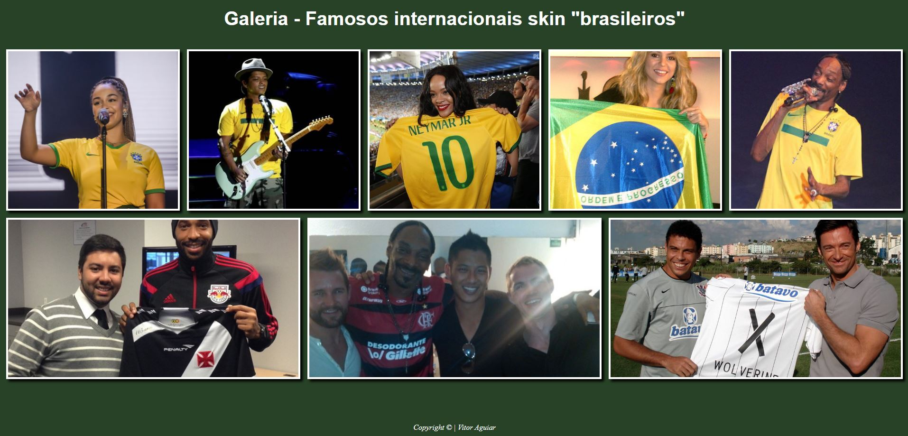

# Galeria 
Primeira galeria flex criada, com fins didáticos, para o curso de desenvolvimento de sistemas do [SENAI Jandira](https://jandira.sp.senai.br/), sobre orientação do professor [Fernando Leonid](https://github.com/fernandoleonid).

## Objetivo do exercício
Realizar o desenvolvimento de uma galeria com oito imagens de acordo com o exemplo exigido pelo o professor.

## Website
A galeria pode ser acessada pelo link: [vitoraguiarc](vitoraguiarc.github.io/galeria//)

## Tecnológias
* HTML5
* CSS3
* VSCODE

## Screenshot
